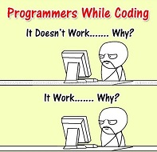

# js-for-testers

**_Explore, collaborate and learn together._**

```text
“When you’re curious, you find lots of interesting things to do.”
- Walt Disney
```

## Goal: Build some useful skills and have fun



**Topics:**

- Chrome Dev Tools
- Basic coding skills, using JavaScript
- Git, Bash, Markdown
- Code quality - principles (DRY, KISS, YAGNI), tools
- Automation
- VS Code, Node.js, npm
- Web pages - HTML, CSS
- Test framework - Mocha/Chai
- Pipeline - GitHub Actions and Workflows, Docker
- Tools: Postman, Cypress, Playwright

`PS. This series is more a teaser than an end to end training.`

### 1. Prerequisites

- Chrome browser
- [NodeJS](https://nodejs.org/en/download), prefferable the latest LTS version - 20.11.1

### 2. Structure

7 biweekly sessions of 2 hours

| #   | Date       | Title                                                 | Topics                                                     |
| --- | ---------- | ----------------------------------------------------- | ---------------------------------------------------------- |
| 1   | 03.04.2024 | [Let's speak JS](./src/sessions//session-1/README.md) | Chrome DevTools (Console, Snippets), HTML, JS introduction |
