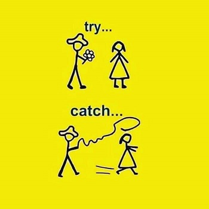

# js-for-testers

Explore, collaborate and learn together.

```text
“When you’re curious, you find lots of interesting things to do.”
- Walt Disney
```

## Goal: Build some useful skills and have fun



**Topics:**

- Basic coding skills, using JavaScript
- Git, Bash, Markdown
- Code quality - principles (DRY, KISS, YAGNI), tools
- Automation
- Chrome Dev Tools
- VS Code, Node.js, npm
- Web pages - HTML, CSS
- Test framework - Mocha/Chai
- Pipeline - GitHub Actions and Workflows, Docker
- Tools: Postman, Cypress, Playwright

`PS. This series is more a teaser than an end to end training.`

### 2. Structure

7 biweekly sessions of 2 hours
