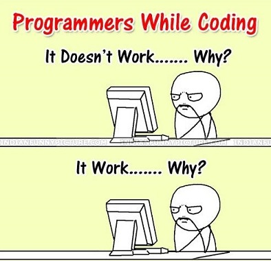

# Let's speak JS

```text
“You can never cross the ocean until you have the courage to loose sight of the shore.”    
- Cristopher Columbus
```



## Content

- [Let's speak JS](#lets-speak-js)
  - [Content](#content)
    - [1. Chrome DevTools](#1-chrome-devtools)
      - [1.1. Console](#11-console)
      - [1.2. Sources/Snippets](#12-sourcessnippets)
    - [2. JS introduction](#2-js-introduction)
      - [2.1. console.log](#21-consolelog)
      - [2.2. Primitives \& Typeof](#22-primitives--typeof)
      - [2.3. String](#23-string)
      - [2.4. JSON](#24-json)
      - [2.5. Functions basics](#25-functions-basics)
      - [2.6. Object](#26-object)
    - [3. Resources](#3-resources)

### 1. [Chrome DevTools](https://developer.chrome.com/docs/devtools)

#### 1.1. [Console](https://developer.chrome.com/docs/devtools/console)

#### 1.2. [Sources/Snippets](https://developer.chrome.com/docs/devtools/javascript/snippets)

### 2. JS introduction

```javascript
// Variables definitions: let and const are block scoped, var is function scoped.
let age; // undefined, you can reassign name
age = 30;
age = age++;

const id = 1111; // you cannot reassign id
//id = 1112; // uncomment and try, it will throw TypeError: Assignment to constant variable

var isEmployed = true; // you can reassign isEmployed, declaration is hoisted
isEmployed = true;
```

#### 2.1. [console.log](https://developer.mozilla.org/en-US/docs/Web/API/console/log_static)

```javascript
/*
Car info:
Name: Porsche
Model: 711
Is diesel: no
Engine:
  capacicy: 2000
  power: 300 hp
Available colors: red, green, orange
*/

const name = 'Porsche';
const model = '711';
const isDiesel = false;
const engine = {
  capacity: 2000,
  hp: 300,
};
const colors = ['red', 'green', 'orange'];

const myCar = {
  name,
  model,
  'is diesel': isDiesel,
  engine,
  colors,
};

console.log('Car info (prettified):', JSON.stringify(myCar, null, 2));

// access object properties
console.log("Car's name: ", myCar.name);
console.log("Car's engine capacity: ", myCar.engine.capacity);
console.log('Is diesel: ', myCar['is diesel']);
console.log('Available colors count: ', myCar.colors.length);
console.log('Second available color: ', myCar.colors[1]);
```

#### 2.2. [Primitives](https://developer.mozilla.org/en-US/docs/Glossary/Primitive) & [Typeof](https://developer.mozilla.org/en-US/docs/Web/JavaScript/Reference/Operators/typeof)

```javascript
let name = 'John Doe';

let age = 30;

let isEmployed = true;

let salary;

const obj = null;

const job = {
  title: 'qa',
  level: 5,
};

const jobs = ['dev', 'qa', 'dev-ops'];

logTable({
  name,
  age,
  isEmployed,
  salary,
  obj,
  job,
  jobs,
});

function logTable(obj) {
  const processedObj = Object.entries(obj).map(
    ([key, val]) => new Info(key, val),
  );

  console.table(processedObj);

  // constructor function
  function Info(name, value) {
    this.name = name;
    this.value = value;
    this.typeof = typeof value;
  }
}
```

#### 2.3. [String](https://developer.mozilla.org/en-US/docs/Web/JavaScript/Reference/Global_Objects/String)

```javascript
// strings can be created using double quotes ("), single quote (') or backticks (`)
const text = 'The quick brown fox jumps over a lazy dog';
const message = '  Hello world!  ';
const name = 'John Doe';
const colors = `
- red
- green
- blue`;

console.log('text: ', text);
console.log('text length: ', text.length);
console.log('message: ', message);
console.log('colors:', colors);

const letters = text.split('');
console.log('letters: ', letters);

const words = text.split(' ');
console.log('words: ', words);

console.log(message.trim().toLowerCase());
console.log(colors.toUpperCase());

// string interpolation - uses backticks
console.log(`The text "${text}" has ${text.length} characters.`);
```

#### 2.4. [JSON](https://developer.mozilla.org/en-US/docs/Web/JavaScript/Reference/Global_Objects/JSON)

```javascript
const user = {
  name: 'Jane Doe',
  age: 25,
  isEmployed: true,
  role: undefined,
  job: null,
  skills: ['JavaScript', 'Cypress', 'Selenium'],
  helloMessage: function () {
    console.log('Hello, I am Jane Doe.');
  },
};

const userStringified = JSON.stringify(user, null, 2); // string (it strips undefined and functions values)

console.log(userStringified);

const newUserFromUserStringified = JSON.parse(userStringified); // object

console.log(newUserFromUserStringified);
```

#### 2.5. [Functions basics](https://developer.mozilla.org/en-US/docs/Web/JavaScript/Guide/Functions)

```javascript
function double(nr) {
  return nr * 2;
}

const doubleNr = nr => nr * 2;

console.log(double(100));
console.log(doubleNr(100));
message("Let's learn more JS!");

function message(msg) {
  alert(msg);
}
```

#### 2.6. [Object](https://developer.mozilla.org/en-US/docs/Learn/JavaScript/Objects/Basics)

```javascript
const employee = {
  firstName: 'Kevin',
  lastName: 'Jones',
  age: 30,
  isEmployed: false,
};

console.log(Object.keys(employee));
console.log(Object.values(employee));
console.log(Object.entries(employee));
```

### 3. Resources

- [MDN JavaScript](https://developer.mozilla.org/en-US/docs/Web/JavaScript)

- [W3Schools](https://www.w3schools.com/js/)
