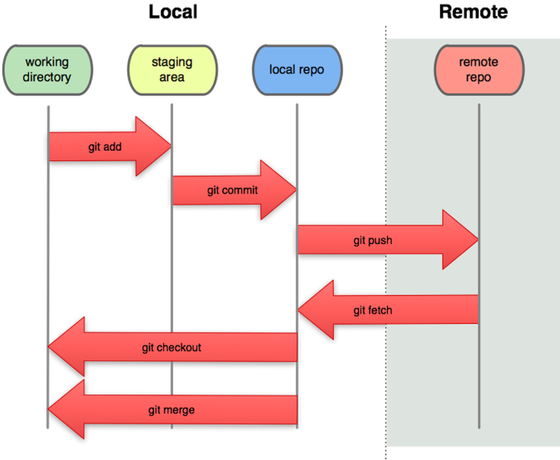

# Git & GitHub

```text
“When you’re curious, you find lots of interesting things to do.”
- Walt Disney
```


## Content

- [Git \& GitHub](#git--github)
  - [Content](#content)
    - [1. Git](#1-git)
      - [1.1 Git configuration](#11-git-configuration)
      - [1.2 Simplest flow](#12-simplest-flow)
      - [1.3 Using SSH keys for GitHub authentication](#13-using-ssh-keys-for-github-authentication)
    - [2. Bash (GitBash)](#2-bash-gitbash)
      - [2.1 Basic commands](#21-basic-commands)
      - [2.2 Copy/Paste Selected text in CLI](#22-copypaste-selected-text-in-cli)
      - [2.3 Setting variables](#23-setting-variables)
      - [2.4 Bash profile file](#24-bash-profile-file)
    - [3. vi (CLI visual editor)](#3-vi-cli-visual-editor)
    - [4. GitHub](#4-github)
      - [4.1 Create a GitHub Acount](#41-create-a-github-acount)
      - [4.2 GitHub Actions](#42-github-actions)
      - [4.3 Repository secrets](#43-repository-secrets)

### 1. [Git](https://git-scm.com)

- Install from [downloads page](https://git-scm.com/downloads) - choose **GitBash**

- [Git documentation](https://git-scm.com/doc)
  - [Pro Git - 2nd Edition (2014)](https://git-scm.com/book/en/v2)

#### 1.1 [Git configuration](https://git-scm.com/book/en/v2/Customizing-Git-Git-Configuration)

- configuration levels

  - global
  - system
  - local

- display current global git config

```bash
git config --global -l
```

- user setup

```bash
git config --global user.name "Dan Rusu"
git config --global user.email danginkgo@yahoo.com
```

- convert CRLF to LF on commit but not the other way around

```bash
git config --global core.autocrlf input
```

- assume --set-upstream on default push when no upstream tracking exists for the current branch

```bash
git config --global --add --bool push.autoSetupRemote true
```

- on OS (Windows, Mac) with case insensitive file systems this helps a lot

```bash
git config --global core.ignorecase false
```

- set autocorrect for commands typos

```bash
git config --global help.autocorrect 10
```

#### 1.2 Simplest flow



```bash
# 1. Create a GitHub project
# 2. Clone the project from GitHub (or other remotes)
cd dev_directory
git clone git@github.com:danrusu/js-for-testers.git # this is using SSH keys
cd js-for-testers
ls -all
git remote -v # print remotes (only one in our case with an alias of origin)
git branch # show local branches; current branch has a * in front
git branch -r # show remote branches
git pull # update local repository

# 3. Create a new development branch
git checkout -b dev-branch # creates a new branch and checks it out; usualy there is a branch naming convention
git branch # the current branch should be dev-branch

# 4. Start development - create/delete/edit files

# 5. Stage new files
git status # check file differences
git add -A # you can use 'git add .'
git status

# 6. Commit changes to local repository
git commit -m "fixed bug 124"
git status # local branch contains all changes

# 7. Push the current branch to the remote repository
git push

# 8. From GitHub open a PR (Pull Request) to merge 'dev-branch' to 'master'
# Wait until the PR is reviewed and mmerge it to master.

# 9. Checkout the master branch and update it from remote
git checkout master # you can also use 'git checkout -' to toggle between last two used branches
git pull
```

- [git stash ](https://git-scm.com/book/en/v2/Git-Tools-Stashing-and-Cleaning) - stash your changes before you commit to work for something else, apply the changes later

  ```bash
  # do some changes
  git stash # save changes to stash
  git stash list
  git stash apply # apply stashed changes
  ```

- [commit --amend](https://smartlogic.io/blog/git-commit-amend/)
  ```bash
  git commit --amend -m "fixed commit message" # change last commit message
  git commit --amend -m --no-edit # add more changes to last commit, keeping the commit message
  ```

#### 1.3 Using SSH keys for GitHub authentication

- create a local SSH key

```bash
ssh-keygen -t rsa # -b 4096 -C "your_email@example.com"
ls ~/.ssh
cat id_rsa.pub # print the rsa public key; we'll use this one
# copy the key to clipboard
```

- go to your [GitHub profile](https://github.com/settings/profile) and add your key to [SSH and GPG keys](https://github.com/settings/profile)

### 2. Bash (GitBash)

`Use TAB key for path autocompletion/suggestions!`

`Bash knowledge will help when working with Docker.`

- `.` represents current folder
- `..` represents parent folder
- `/` is the path separator (linux style)
- `~` is the user home directory

#### 2.1 Basic commands

```bash
command_name --help # prints the help information for the command_name command

cd # changes current directory to home directory; same as 'cd ~'
pwd # print working (current) directory
cd - # toggle to previous work directory

ls # list all files in current directory
mkdir git_bash_demo # creates git_bash_demo directory

cd git_bash_demo # change current directory to git_bash_demo

touch file.txt # create new file
echo "first line" > file.txt # creates file.txt and writes "first line" in it
echo "second line" >> file.txt # appends "second line" to file.txt
ls -all
cat file.txt # prints file.txt content
rm file.txt # deletes file.txt; to remove a folder add a -r (recursive) flag; use -f to force deleting a file/folder

alias gs='git status' # set an alias for a command
alias gs # print an existing alias
alias # print all aliases
gs
unalias gs # remove alias
```

#### 2.2 Copy/Paste Selected text in CLI

- Copy - `CTRL + INSERT`
- Paste - `SHIFT + INSERT`

#### 2.3 Setting variables

| Variable type        | Command                                                       | Description                                              |
| -------------------- | ------------------------------------------------------------- | -------------------------------------------------------- |
| shell variable       | `MY_API_TOKEN='api_token_1234'`                               | available only in the current shell                      |
| environment variable | `export MY_PASSWORD='pass0rd'`                                | available in all child processes created from that shell |
| global variable      | add `export MY_GLOBALT_TOKEN='abc***xyz'` to the bash profile | available in all bash terminals                          |

#### 2.4 Bash profile file

- location (preferred): `~/.profile`
- it's a good place for saving aliases and global environment variables
- this is a bash file so you can also create global functions within

### 3. vi (CLI visual editor)

```bash
vi file_name # open the file for editing
```

vi basic usage

- `INSERT` or `i` - enter insert mode
- `ESC` - enter command mode

  | Command (in command mode, followed by ENTER) | Description                                       |
  | -------------------------------------------- | ------------------------------------------------- |
  | **:q**                                       | close file without saving if no changes were made |
  | **:q!**                                      | force closing without saving if changes were made |
  | **:wq** or **:x**                            | save changes and then close the file              |
  | :line_number                                 | go to a specific line number                      |
  | **dd**                                       | delete current line                               |
  | **yy**                                       | yank (copy) current line                          |
  | **p**                                        | paste copied text                                 |
  | **/word**                                    | search for word (forward)                         |

### 4. [GitHub](https://docs.github.com/en)

#### 4.1 [Create a GitHub Acount](https://docs.github.com/en/get-started/start-your-journey/creating-an-account-on-github)

#### 4.2 [GitHub Actions](https://docs.github.com/en/actions)

- [Workflows syntax](https://docs.github.com/en/actions/writing-workflows/workflow-syntax-for-github-actions)
- [Events that trigger workflows](https://docs.github.com/en/actions/writing-workflows/choosing-when-your-workflow-runs/events-that-trigger-workflows)
  - [workflow_dispatch](https://docs.github.com/en/actions/writing-workflows/choosing-when-your-workflow-runs/events-that-trigger-workflows#workflow_dispatch) - manually trigger a workflow
  - [pull_request](https://docs.github.com/en/actions/writing-workflows/choosing-when-your-workflow-runs/events-that-trigger-workflows#pull_request)
  - [schedule](https://docs.github.com/en/actions/writing-workflows/choosing-when-your-workflow-runs/events-that-trigger-workflows#schedule) - scheduled workflow using UTC times with POSIX cron syntax
  ```txt
  ┌───────────── minute (0 - 59)
  │ ┌───────────── hour (0 - 23)
  │ │ ┌───────────── day of the month (1 - 31)
  │ │ │ ┌───────────── month (1 - 12 or JAN-DEC)
  │ │ │ │ ┌───────────── day of the week (0 - 6 or SUN-SAT)
  │ │ │ │ │
  │ │ │ │ │
  │ │ │ │ │
  * * * * *
  ```
- [Job runners](https://docs.github.com/en/actions/writing-workflows/choosing-where-your-workflow-runs/choosing-the-runner-for-a-job)
- [Workflow badges](https://docs.github.com/en/actions/monitoring-and-troubleshooting-workflows/monitoring-workflows/adding-a-workflow-status-badge)

  

#### 4.3 Repository secrets

- [Create secrets](https://docs.github.com/en/actions/security-for-github-actions/security-guides/using-secrets-in-github-actions#creating-secrets-for-a-repository)
  - [create secret for actions](https://github.com/danrusu/js-for-testers/settings/secrets/actions/new)
- [Use secrets in workflows](https://docs.github.com/en/actions/security-for-github-actions/security-guides/using-secrets-in-github-actions#using-secrets-in-a-workflow)
