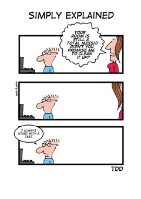

# Lets's code

```text
“Perfection is achieved, not when there is nothing more to add, but when there is nothing left to take away.”
- Antoine de Saint-Exupéry
```



## Content

- [Lets's code](#letss-code)
  - [Content](#content)
    - [1. Switch the value stored in two variables](#1-switch-the-value-stored-in-two-variables)
    - [2. Create a simple console logger that you can enable/disable](#2-create-a-simple-console-logger-that-you-can-enabledisable)
    - [3. Object key-value switch](#3-object-key-value-switch)
    - [4. Sort object keys alphabetically](#4-sort-object-keys-alphabetically)
    - [5. Palindrome](#5-palindrome)
    - [6. Repetition map info from array](#6-repetition-map-info-from-array)

`ADVICE: Create functions to solve the following tasks and test them.`

### 1. Switch the value stored in two variables

```javascript
let a = 7;
let b = 12;
// add your code here
console.log(a, b); // should print 12 7
```

| Solution                                                              |
| --------------------------------------------------------------------- |
| [src/session5/switchVariables.js](../src/session5/switchVariables.js) |

### 2. Create a simple console logger that you can enable/disable

| Solution                                      |
| --------------------------------------------- |
| [src/utils/logger.js](../src/utils/logger.js) |

### 3. Object key-value switch

`Task:` From a key-value pairs object, create a new object that has the values of the original object as keys and the original object keys as values. We'll asume that all values from the original object are unique.

```javascript
// input
{
  JavaSCript: '100',
  TypeScript: '101',
  HTML: '110',
  CSS: '111',
  React: '120',
  Vue: '121',
  Angular: '122',
  'C#': '200',
  Java: '300',
  Go: '400',
}
// output
{
  100: 'JavaSCript',
  101: 'TypeScript',
  110: 'HTML',
  111: 'CSS',
  120: 'React',
  121: 'Vue',
  122: 'Angular',
  200: 'C#',
  300: 'Java',
  400: 'Go'
}
```

| Solution                                                                        | Test                                                                                       |
| ------------------------------------------------------------------------------- | ------------------------------------------------------------------------------------------ |
| [src/session5/objectKeyValueSwitch.js](../src/session5/objectKeyValueSwitch.js) | [src/session5/objectKeyValueSwitch.spec.js](../test/session5/objectKeyValueSwitch.spec.js) |

### 4. Sort object keys alphabetically

```javascript
// input
{
  c: 102,
  a: 100,
  b: 101,
  d: 103,
}
//output
{
  a: 100,
  b: 101,
  c: 102,
  d: 103
}
```

| Solution                                                            | Test                                                                           |
| ------------------------------------------------------------------- | ------------------------------------------------------------------------------ |
| [src/session5/sortObjectKeys.js](../src/session5/sortObjectKeys.js) | [src/session5/sortObjectKeys.spec.js](../test/session5/sortObjectKeys.spec.js) |

### 5. Palindrome

`Task:` Create a function that returns if a word (string) is a palindrome.

```
input     | output
''        | true
'x'       | true
'maoam'   | true
'mm'      | true
'yoyo'    | false
'ab'      | false
```

| Solution                                                    | Test                                                                   |
| ----------------------------------------------------------- | ---------------------------------------------------------------------- |
| [src/session5/palindrome.js](../src/session5/palindrome.js) | [src/session5/palindrome.spec.js](../test/session5/palindrome.spec.js) |

### 6. Repetition map info from array

`Task:` Count elements repetition within an array that contains strings, store information into an object, sorted by repetition value.

```
// input
[
  'red',
  'green',
  'blue',
  'red',
  'red',
  'blue'
]
// output
{
  green: 1,
  blue: 2,
  red: 3
}
```

| Solution                                                          | Test                                                                         |
| ----------------------------------------------------------------- | ---------------------------------------------------------------------------- |
| [src/session5/repetitionMap.js](../src/session5/repetitionMap.js) | [src/session5/repetitionMap.spec.js](../test/session5/repetitionMap.spec.js) |
