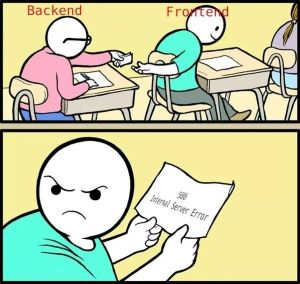
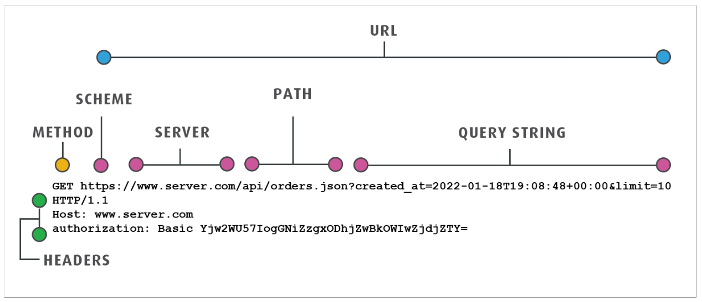

# APIs & Postman

```text
“Be liberal in what you accept, and conservative in what you send.”
- Postel's Law (Robustness Principle)
```



### 1. HTTP requests / responses



- MDN docs

  - [Requests](https://developer.mozilla.org/en-US/docs/Web/HTTP/Messages#http_requests)
  - [Responses](https://developer.mozilla.org/en-US/docs/Web/HTTP/Messages#http_requests)

- HTTP Status codes - indicate the success or failure of a request

  - 1xx informational response – the request was received, continuing processing.
  - **2xx successful** – the request was successfully received, understood, and accepted.
  - 3xx redirection – further action needs to be taken in order to complete the request.
  - **4xx client error** – the request contains bad syntax or cannot be fulfilled.
  - **5xx server error** – the server failed to fulfil an apparently valid request.

### 2. [Dummy web app anatomy](https://github.com/danrusu/node-js-todo-app)

- [Express.js](https://expressjs.com/)
- Frontend - html, CSS, js
- Backend - API - endpoints
- Inspect network activity with DevTools - [Network tab](https://developer.chrome.com/docs/devtools/network)

### 3. Postman

- [Postman app](https://www.postman.com/downloads/)
- [Online](https://www.postman.com/)

- [Learning center](https://learning.postman.com/docs/introduction/overview/)
  - [Console](https://learning.postman.com/docs/sending-requests/response-data/troubleshooting-api-requests/)
  - [Scripts](https://learning.postman.com/docs/tests-and-scripts/tests-and-scripts/)
  - [Packages - reuse scripts](https://learning.postman.com/docs/tests-and-scripts/write-scripts/package-library/)
  - [Echo service](https://learning.postman.com/docs/developer/echo-api/) - usefull for practice

### 4. Newman

- [learning center](https://learning.postman.com/docs/collections/using-newman-cli/command-line-integration-with-newman/)

- install

```bash
npm install -g newman
```

- usage help

```bash
newman run -h
```

- run the TODO collection

```bash
newman run TODO.postman_collection.json -e LOCAL.postman_environment.json
```

- reporters

  - install

  ```bash
   npm install -g newman-reporter-htmlextra
  ```

  - run with reporters enabled

  ```bash
  newman run TODO.postman_collection.json -e TODO.postman_environment.json -r json,cli,htmlextra
  ```
