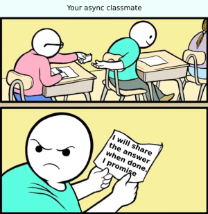

# Async basics

```text
“Simplicity is about subtracting the obvious and adding the meaningful.”
- John Maeda
```



## Content

- [Async basics](#async-basics)
  - [Content](#content)
    - [1. IIFE - **I**mmediately **I**nvoked **F**unction **E**xpression](#1-iife---immediately-invoked-function-expression)
    - [2. Promise](#2-promise)
    - [2.1 **Definition:** `The Promise object represents the eventual completion (or failure) of an asynchronous operation and its resulting value.`](#21-definition-the-promise-object-represents-the-eventual-completion-or-failure-of-an-asynchronous-operation-and-its-resulting-value)
    - [2.2 Blocking vs non-blocking](#22-blocking-vs-non-blocking)
    - [2.3 Promise states:](#23-promise-states)
    - [2.4 How to create a Promise object](#24-how-to-create-a-promise-object)
    - [2.5 Demo 1 - Using `.then`, `.catch`, `.finally`](#25-demo-1---using-then-catch-finally)
    - [2.6 Demo 2 - Let's order some food](#26-demo-2---lets-order-some-food)
    - [3. Async function](#3-async-function)
    - [4. setTimeout](#4-settimeout)
    - [5. Files IO](#5-files-io)
    - [6. Fetch API](#6-fetch-api)
    - [7. Code first api tests](#7-code-first-api-tests)
    - [8. Homework](#8-homework)

### 1. [IIFE](https://developer.mozilla.org/en-US/docs/Glossary/IIFE) - **I**mmediately **I**nvoked **F**unction **E**xpression

Use cases:

- avoid polluting main namespace
- execute an async function (allows to use await)
- the module pattern; `to read:` [Closures docs](https://developer.mozilla.org/en-US/docs/Web/JavaScript/Closures)

```javascript
(function () {
  // …
})();

(() => {
  // …
})();

(async () => {
  // …
})();
```

### 2. [Promise](https://developer.mozilla.org/en-US/docs/Web/JavaScript/Reference/Global_Objects/Promise)

### 2.1 **Definition:** `The Promise object represents the eventual completion (or failure) of an asynchronous operation and its resulting value.`

### 2.2 [Blocking vs non-blocking](https://nodejs.org/en/learn/asynchronous-work/overview-of-blocking-vs-non-blocking)

### 2.3 Promise states:

- _pending_: initial state, neither fulfilled nor rejected.
- _fulfilled_: meaning that the operation was completed successfully.
- _rejected_: meaning that the operation failed.

A promise is said to be **settled** if it is either fulfilled or rejected, but not pending.

### 2.4 How to create a Promise object

```javascript
const promise = new Promise((resolve, reject) => {
  // evaluate rejection condition
  if (errorCondition) {
    reject(new Error('errorMessage')); // similar with throwing an error
  }
  resolve(value); // similar with returning a value
});
```

### 2.5 [Demo 1](../src/session8/promise-demo1.js) - Using `.then`, `.catch`, `.finally`

```javascript
function checkMail() {
  return new Promise((resolve, reject) => {
    if (Math.random() > 0.5) {
      resolve('Mail has arrived');
    } else {
      reject(new Error('Failed to arrive'));
    }
  });
}

checkMail()
  .then(mail => {
    console.log(mail);
  })
  .catch(err => {
    console.error(err);
  })
  .finally(() => {
    console.log('Experiment completed');
  });
```

### 2.6 [Demo 2 - Let's order some food](../src/session8/promise-demo2.js)

```javascript
const stock = ['fries', 'burger', 'icecream'];

const isValidOrder = (...order) => {
  for (const food of order) {
    if (!stock.includes(food)) {
      return {
        outOfStockFood: food,
        orderStatus: false,
      };
    }
  }
  return { orderStatus: true };
};

const getFood = (...order) =>
  new Promise((resolve, reject) => {
    const { orderStatus, outOfStockFood } = isValidOrder(...order);
    if (orderStatus) {
      console.log(`... preparing ${order}`); // this should take time
      resolve(order);
    }
    reject(new Error(`${outOfStockFood} is out of stock`));
  });

const myFood = getFood('fries', 'burger');
console.log('myFood: ', myFood);

myFood
  .then(food => {
    console.log(`prepared ${food}`);
  })
  .catch(err => {
    console.log(`We are sorry, ${err.message}`);
  });
  .finally(() => {
    console.log('Food ordering finished');
  });
```

### 3. [Async function](https://developer.mozilla.org/en-US/docs/Web/JavaScript/Reference/Statements/async_function)

`Async function` declaration:

```javascript
async function name(params) {
  // statements;
  // the await mechanism may be used
}
```

`Each time when an async function is called, it returns a new Promise
which will be resolved with the value returned by the async function,
or rejected with an exception uncaught within the async function.`

The [await](https://developer.mozilla.org/en-US/docs/Web/JavaScript/Reference/Operators/await) operator is used to wait for a Promise and get its fulfillment value.
It can only be used inside an async function or at the top level of a module.

```javascript
(async () => {
  try {
    const myFood = await getFood('fries', 'burger'); // add 'pizza' to go to the catch branch
    console.log('myFood: ', myFood);
  } catch (err) {
    console.log(`We are sorry, ${err.message}`);
  }
})();
```

### 4. [setTimeout](https://developer.mozilla.org/en-US/docs/Web/API/Window/setTimeout)

- [event loop](https://developer.mozilla.org/en-US/docs/Web/JavaScript/Event_loop)

- create a wait function

```javascript
const wait = timeout =>
  new Promise(resolve => {
    setTimeout(resolve, timeout);
  });

(async () => {
  await wait(3000);
  console.log('...waited for 3s');
})();
```

### 5. Files IO

- [Promises API](https://nodejs.org/api/fs.html#promises-api) - recommended
  - [example](../src/session8/fs-promise-api.js)
- [Callback API](https://nodejs.org/api/fs.html#callback-api)
- [Synchronous API](https://nodejs.org/api/fs.html#synchronous-api)
  - [example](../src/session8/fs-sync-api.js)

### 6. [Fetch API](https://developer.mozilla.org/en-US/docs/Web/API/Fetch_API/Using_Fetch)

- go to [node-js-todo-app])(https://github.com/danrusu/node-js-todo-app) project and start server in dev mode

```bash
npm run dev
```

- use fetch api to hit `/health-check` endpoint and get the response - use [fetch.js](../src//session8/fetch.js)

### 7. [Code first api tests](../test/session8/todo-app.api.spec.js)

Prerequisites: For TODO APP authorization you need to create a `.env` local file like:

```text
TODO_USERNAME=tester
TODO_PASSWORD=123
```

### 8. Homework

Create API tests for [TODO APP](https://github.com/danrusu/node-js-todo-app) using _fetch_,
similar to the available [Postman tests](https://github.com/danrusu/node-js-todo-app/tree/master/postman).

Use example in [todo-app.api.spec.js](../test/session8/todo-app.api.spec.js).
